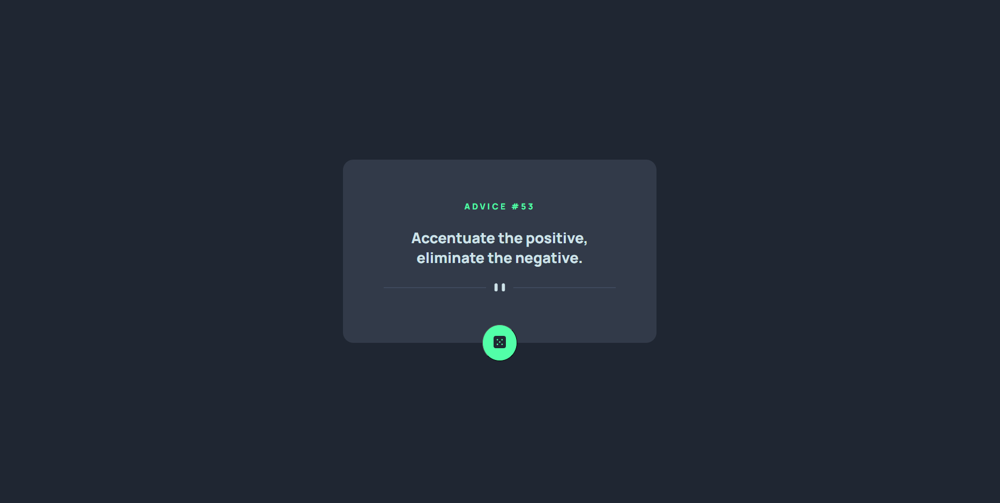

# Frontend Mentor - Advice generator app solution

This is a solution to the [Advice generator app challenge on Frontend Mentor](https://www.frontendmentor.io/challenges/advice-generator-app-QdUG-13db). Frontend Mentor challenges help you improve your coding skills by building realistic projects.

## Table of contents

- [Overview](#overview)
  - [The challenge](#the-challenge)
  - [Screenshot](#screenshot)
  - [Built with](#built-with)
  - [What I learned](#what-i-learned)
  - [Continued development](#continued-development)
- [Author](#author)

## Overview

### The challenge

Users should be able to:

- View the optimal layout for the app depending on their device's screen size
- See hover states for all interactive elements on the page
- Generate a new piece of advice by clicking the dice icon

### Screenshot




### Built with

- Semantic HTML5 markup
- CSS custom properties
- JavaScript technology
- Flexbox
- Desktop-first workflow

### What I learned

I learn something about how to use API's!

I'm really proud of my function to create advices!

```js
function createAdvice() {

  //If there's a advice then delete it.
  if (adviceIDZone.hasChildNodes() && adviceZone.hasChildNodes()) {
    adviceIDZone.childNodes.forEach(child => child.remove());
    adviceZone.childNodes.forEach(child => child.remove());
  };

  fetch(advice_API)
  //Json turn the API value into a Null Object.
  .then(response => response.json())
  .then((container) => {
    //Turn the null object into a normal object.
    Object.setPrototypeOf(container, Object.prototype);
    let adviceContainer = container.slip;
    let adviceValue = adviceContainer.advice;
    let adviceIDValue = adviceContainer.id;

    let adviceID = document.createTextNode(adviceIDValue);
    let advice = document.createTextNode(adviceValue);

    adviceIDZone.append(adviceID);
    adviceZone.append(advice);
  });

  seconds = 0;
};
```

### Continued development

I'm going to focus my technique with the API's cause this is a really powerful resource!

## Author

- Frontend Mentor - [@CrisD3v](https://www.frontendmentor.io/profile/CrissD3V)