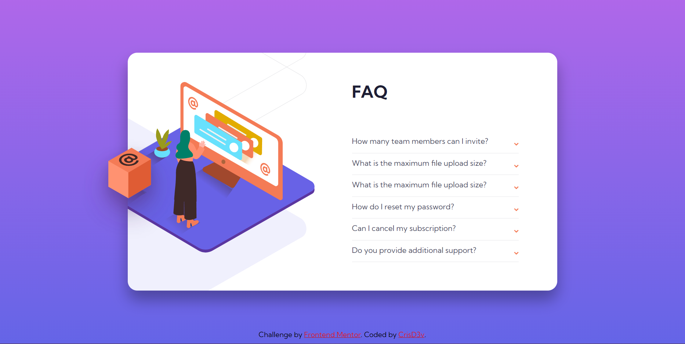

# Frontend Mentor - FAQ accordion card solution

Esta es una solución al [FAQ accordion card challenge on Frontend Mentor](https://www.frontendmentor.io/challenges/faq-accordion-card-XlyjD0Oam). Los retos de Frontend Mentor ayudan mucho a mejorar tus habilidades de código construyendo proyectos realistas.

## Table of contents

- [Descripción general](#Descripción)
  - [El reto](#Reto)
  - [Screenshot](#screenshot)
  - [Links](#links)
- [Mi proceso](#Proceso)
  - [Construido con](#Construcción)
  - [¿Qué aprendí?](#Aprendí)
  - [Continued development](#continued-development)
  - [Useful resources](#useful-resources)
- [Author](#author)

**Note: Delete this note and update the table of contents based on what sections you keep.**

## Descripción

### Reto

El usuario debe poder:

- Ver el "layout" óptimo dependiendo del tamaño de pantalla de su dispositivo.
- Ver estados de "hover" interactivos para todos los elementos en la página.
- Mostrar/Esconder las respuestas a la pregunta cuando la pregunta es clickeada.

### Screenshot



### Links

- URL de la solución: [Add solution URL here](https://your-solution-url.com)
- URL del sitio en Vivo: [Add live site URL here](https://your-live-site-url.com)

## Proceso

### Construcción

Construido con:

- HTML5.
- Propiedades personalizadas de CSS.
- Flexbox.
- Flujo de trabajo "Desktop-first"

### Aprendí

Gracias a este proyecto he aprendido la utilización de selectores CSS para dar interactividad a la página sin necesidad de utilizar JavaScript:

```CSS

[type="checkbox"]:checked ~ .arrow {
    top: 5px;
    transform: rotate(180deg);
}

[type="checkbox"]:checked ~ .answer {
    display: block;
    width: 100%;
    font-size: 12px;
    color: var(--Dark-grayish-blue);
    margin-top: 10px;
}

[type="checkbox"]:checked + .question {
    font-weight: 700;
}
```

Además he aprendido el uso de "order" para darle un mejor posicionamiento a los elementos con Flexbox.

### Continued development

Gracias a este proyecto me he dado cuenta de que aún flojeo mucho en cuanto a temas de posicionamiento de elementos. Pienso seguir practicando eso debido a su importancia.

También he notado que me complico mucho con los tamaños y separaciones de los elementos. No creo hacerlo tan mal, pero no me siento cómodo. Practicaré eso también.

### Useful resources

- [Example resource 1](https://es.stackoverflow.com/questions/37084/cómo-seleccionar-el-elemento-anterior-a-otro-con-css) - En esta publicación en StackOverFlow encontré una respuesta a mi duda y, de paso, aprendí el uso de "order"

## Author

- Frontend Mentor - [@CrissD3v](https://www.frontendmentor.io/profile/CrissD3V)
- CodePen - [@CrisD3v](https://codepen.io/CrisD3v)